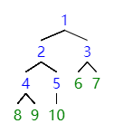
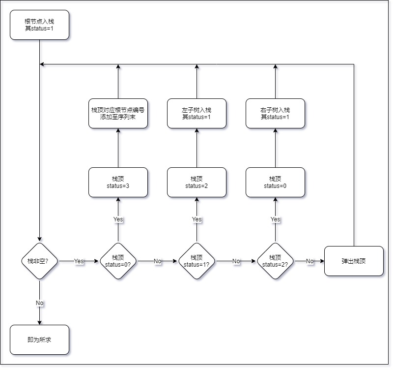
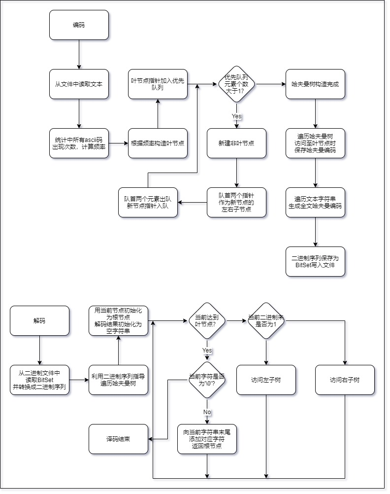

# 《数据结构与算法2021秋》课程报告（实验二）

| 学号       | 姓名   | 得分 |
|------------|------|------|
| 120L021403 | 冯新航 |      |

## 遍历二叉树

已知一个二叉树的先序遍历、中序遍历，建立二叉树，并分别用输出该二叉树的先序遍历、中序遍历、后序遍历。

**注**：作为练习，本题的遍历算法不允许使用**递归**。

+ 输入格式

  第一行一个整数 `n`，表示二叉树的节点个数。

  第二行是 `n` 个整数的序列，表示二叉树的先序遍历。

  第三行是 `n` 个整数的序列，表示二叉树的中序遍历。

  `n >= 8`

+ 输出格式

  三行序列，分别表示二叉树的先序遍历、中序遍历、后序遍历。

+ 样例输入

  ```bash
  10
  1 2 4 8 9 5 10 3 6 7
  8 4 9 2 5 10 1 6 3 7
  ```

+ 样例输出

  ```bash
  1 2 4 8 9 5 10 3 6 7
  8 4 9 2 5 10 1 6 3 7
  8 9 4 10 5 2 6 7 3 1
  ```

+ 样例解释

  如图，即为所求二叉树。

  

+ 解决方案
  
  + 流程图

  此处仅展示非递归求后序遍历的流程图，先序、中序同理。

  

  + `BinaryTree`： 实现构造、遍历二叉树全部功能的对象。
    + `int size`：二叉树节点个数。
    + `BinaryTree(vector<int> &preorder, vector<int> &midorder)`；以先序遍历`preorder`、中序遍历`midorder`构造二叉树。
    + `const vector<int> &getPostorder()`：返回二叉树的后序遍历，使用递归。
    + `const vector<int> &getPreorderNonRecursion()`：返回二叉树的先序遍历，不使用递归。
    + `const vector<int> &getMidorderNonRecursion()`：返回二叉树的中序遍历，不使用递归。
    + `const vector<int> &getPostorderNonRecursion()`：返回二叉树的后序遍历，不使用递归。
    + `vector<int> preorder, midorder, postorder`：二叉树的先序、中序、后序遍历。;
    + `BinaryTreeNode *root`：二叉树根节点指针。
    + `BinaryTreeNode *build(vector<int> &preorder, vector<int> &midorder)`：以先序遍历`preorder`、中序遍历`midorder`构造二叉树。
    + `void getPostorder(BinaryTreeNode *rt, vector<int> &currentPostorder)`：在已构造的后序遍历序列`currentPostorder`后添加以`root`为根的子树的后序遍历。

  + `BinaryTreeNode`：包含二叉树的节点信息。
    + `int data`：节点编号。
    + `BinaryTreeNode *lchild, *rchild`：左右子树的指针。

  + `GetOrderStackNode`：循环模拟递归过程中的人工栈对象。
    + `GetOrderStackNode(BinaryTreeNode *rt, vector<int> &currentOrder, int status)`：以`rt`、`currentOrder`、`status`初始化当前栈。
    + `int status`：当前栈的状态，`0`: 处理根节点，`1`: 需递归左子树，`2`: 需递归右子树，`3`: 退栈。
    + `BinaryTreeNode *rt`：当前栈对应的节点指针。
    + `vector<int> &currentOrder`: 当前栈已经排好的顺序。

## 哈夫曼树

给出一篇英文文章，构造哈夫曼树，并对其进行编码、译码。

以下输入输出格式**仅供参考**。

+ 输入格式

  从 `article.txt` 中输入一篇英文文章，可能包含 `ascii` 码表的所有字符。

+ 输出格式

  输出至以下 `3` 个文件。

  + `huffman-encode-list.txt`：包含文章字符出现频率，以及编码结果。
  + `binary.txt`：整篇文章的编码结果。
  + `decode-result.txt`：由编码重新解析回文章的结果。

+ 样例输入

  `article.txt`

  ```txt
  What is Lorem Ipsum?
  Lorem Ipsum is simply dummy text of the printing and typesetting industry. Lorem Ipsum has been the industry's standard dummy text ever since the 1500s, when an unknown printer took a galley of type and scrambled it to make a type specimen book. It has survived not only five centuries, but also the leap into electronic typesetting, remaining essentially unchanged. It was popularised in the 1960s with the release of Letraset sheets containing Lorem Ipsum passages, and more recently with desktop publishing software like Aldus PageMaker including versions of Lorem Ipsum.

  Where does it come from?
  Contrary to popular belief, Lorem Ipsum is not simply random text. It has roots in a piece of classical Latin literature from 45 BC, making it over 2000 years old. Richard McClintock, a Latin professor at Hampden-Sydney College in Virginia, looked up one of the more obscure Latin words, consectetur, from a Lorem Ipsum passage, and going through the cites of the word in classical literature, discovered the undoubtable source. Lorem Ipsum comes from sections 1.10.32 and 1.10.33 of "de Finibus Bonorum et Malorum" (The Extremes of Good and Evil) by Cicero, written in 45 BC. This book is a treatise on the theory of ethics, very popular during the Renaissance. The first line of Lorem Ipsum, "Lorem ipsum dolor sit amet..", comes from a line in section 1.10.32.
  The standard chunk of Lorem Ipsum used since the 1500s is reproduced below for those interested. Sections 1.10.32 and 1.10.33 from "de Finibus Bonorum et Malorum" by Cicero are also reproduced in their exact original form, accompanied by English versions from the 1914 translation by H. Rackham.

  Why do we use it?
  It is a long established fact that a reader will be distracted by the readable content of a page when looking at its layout. The point of using Lorem Ipsum is that it has a more-or-less normal distribution of letters, as opposed to using 'Content here, content here', making it look like readable English. Many desktop publishing packages and web page editors now use Lorem Ipsum as their default model text, and a search for 'lorem ipsum' will uncover many web sites still in their infancy. Various versions have evolved over the years, sometimes by accident, sometimes on purpose (injected humour and the like).

  Where can I get some?
  There are many variations of passages of Lorem Ipsum available, but the majority have suffered alteration in some form, by injected humour, or randomised words which don't look even slightly believable. If you are going to use a passage of Lorem Ipsum, you need to be sure there isn't anything embarrassing hidden in the middle of text. All the Lorem Ipsum generators on the Internet tend to repeat predefined chunks as necessary, making this the first true generator on the Internet. It uses a dictionary of over 200 Latin words, combined with a handful of model sentence structures, to generate Lorem Ipsum which looks reasonable. The generated Lorem Ipsum is therefore always free from repetition, injected humour, or non-characteristic words etc.
  ```

+ 样例输出

  `huffman-encode-list.txt`

  ```txt
  ascii code:   0, frequency: 0.0000000, huffman code: 100100001110010100000010010111111010000
  ascii code:   1, frequency: 0.0000000, huffman code: 1001000011100101000000100100
  ascii code:   2, frequency: 0.0000000, huffman code: 100100001110010100000010010111111010001
  ascii code:   3, frequency: 0.0000000, huffman code: 10010000111001010001
  ascii code:   4, frequency: 0.0000000, huffman code: 100100001110010100000010011
  ascii code:   5, frequency: 0.0000000, huffman code: 1001000011100101000000100101000011
  ascii code:   6, frequency: 0.0000000, huffman code: 100100001110010100000010010111111010011
  ascii code:   7, frequency: 0.0000000, huffman code: 1001000011100010101
  ascii code:   8, frequency: 0.0000000, huffman code: 10010000111000000010
  ascii code:   9, frequency: 0.0000000, huffman code: 10010000111000000011101
  ascii code:  10, frequency: 0.0038697, huffman code: 10010101
  ascii code:  11, frequency: 0.0000000, huffman code: 10010000111001010000001001010001
  ascii code:  12, frequency: 0.0000000, huffman code: 100100001110010100000010010111101
  ascii code:  13, frequency: 0.0038697, huffman code: 11011011
  ascii code:  14, frequency: 0.0000000, huffman code: 100100001110010100000010010111111010010
  ascii code:  15, frequency: 0.0000000, huffman code: 1001000011100001
  ascii code:  16, frequency: 0.0000000, huffman code: 10010000111000001
  ascii code:  17, frequency: 0.0000000, huffman code: 100100001110010101
  ascii code:  18, frequency: 0.0000000, huffman code: 10010000111000000100
  ascii code:  19, frequency: 0.0000000, huffman code: 1001000011100000001111
  ascii code:  20, frequency: 0.0000000, huffman code: 10010000111000000011010
  ascii code:  21, frequency: 0.0000000, huffman code: 10010000111001010000001000
  ascii code:  22, frequency: 0.0000000, huffman code: 10010000111000000011100001
  ascii code:  23, frequency: 0.0000000, huffman code: 1001000011100101000000100101001
  ascii code:  24, frequency: 0.0000000, huffman code: 1001000011100101000000100101110
  ascii code:  25, frequency: 0.0000000, huffman code: 100100001110010100000010010100000
  ascii code:  26, frequency: 0.0000000, huffman code: 100100001110010100000010010111100
  ascii code:  27, frequency: 0.0000000, huffman code: 10010000111001010000001001011111011
  ascii code:  28, frequency: 0.0000000, huffman code: 10010000111001010000001001011111111
  ascii code:  29, frequency: 0.0000000, huffman code: 100100001110010100000010010111110101
  ascii code:  30, frequency: 0.0000000, huffman code: 10010000111001010000001001011111100010
  ascii code:  31, frequency: 0.0000000, huffman code: 100100001110011
  ascii code:  32, frequency: 0.1618833, huffman code: 101
  ascii code:  33, frequency: 0.0000000, huffman code: 1001000011100100
  ascii code:  34, frequency: 0.0019349, huffman code: 110110100
  ascii code:  35, frequency: 0.0000000, huffman code: 10010000111001011
  ascii code:  36, frequency: 0.0000000, huffman code: 10010000111000101001
  ascii code:  37, frequency: 0.0000000, huffman code: 1001000011100000000
  ascii code:  38, frequency: 0.0000000, huffman code: 10010000111000000101
  ascii code:  39, frequency: 0.0022573, huffman code: 100100000
  ascii code:  40, frequency: 0.0006450, huffman code: 10011110110
  ascii code:  41, frequency: 0.0006450, huffman code: 10010000110
  ascii code:  42, frequency: 0.0000000, huffman code: 10010000111000000011011
  ascii code:  43, frequency: 0.0000000, huffman code: 1001000011100000001110001
  ascii code:  44, frequency: 0.0103193, huffman code: 1001110
  ascii code:  45, frequency: 0.0012899, huffman code: 011100110
  ascii code:  46, frequency: 0.0109642, huffman code: 1000101
  ascii code:  47, frequency: 0.0000000, huffman code: 1001000011100101000000100101010
  ascii code:  48, frequency: 0.0048371, huffman code: 10010001
  ascii code:  49, frequency: 0.0048371, huffman code: 10010011
  ascii code:  50, frequency: 0.0016124, huffman code: 011100100
  ascii code:  51, frequency: 0.0022573, huffman code: 100100101
  ascii code:  52, frequency: 0.0009674, huffman code: 1101101010
  ascii code:  53, frequency: 0.0012899, huffman code: 1001000010
  ascii code:  54, frequency: 0.0003225, huffman code: 1001000011101
  ascii code:  55, frequency: 0.0000000, huffman code: 10010000111001010000001001010000101
  ascii code:  56, frequency: 0.0000000, huffman code: 10010000111001010000001001010000100
  ascii code:  57, frequency: 0.0006450, huffman code: 11011010111
  ascii code:  58, frequency: 0.0000000, huffman code: 10010000111001010000001001011111110
  ascii code:  59, frequency: 0.0000000, huffman code: 100100001110010100000010010111111001
  ascii code:  60, frequency: 0.0000000, huffman code: 100100001110010100000010010111110100
  ascii code:  61, frequency: 0.0000000, huffman code: 10010000111001010000001001011111101011
  ascii code:  62, frequency: 0.0000000, huffman code: 10010000111001010000001001011111100011
  ascii code:  63, frequency: 0.0012899, huffman code: 1001010011
  ascii code:  64, frequency: 0.0000000, huffman code: 10010000111000100
  ascii code:  65, frequency: 0.0006450, huffman code: 0111001111
  ascii code:  66, frequency: 0.0012899, huffman code: 1001111100
  ascii code:  67, frequency: 0.0025798, huffman code: 100111111
  ascii code:  68, frequency: 0.0000000, huffman code: 100100001110001011
  ascii code:  69, frequency: 0.0012899, huffman code: 1001111101
  ascii code:  70, frequency: 0.0006450, huffman code: 0111001110
  ascii code:  71, frequency: 0.0003225, huffman code: 11011010110
  ascii code:  72, frequency: 0.0006450, huffman code: 10011110010
  ascii code:  73, frequency: 0.0083844, huffman code: 1001011
  ascii code:  74, frequency: 0.0000000, huffman code: 10010000111000101000
  ascii code:  75, frequency: 0.0000000, huffman code: 1001000011100000011
  ascii code:  76, frequency: 0.0074170, huffman code: 1101100
  ascii code:  77, frequency: 0.0016124, huffman code: 011100101
  ascii code:  78, frequency: 0.0000000, huffman code: 1001000011100101001
  ascii code:  79, frequency: 0.0000000, huffman code: 100100001110010100001
  ascii code:  80, frequency: 0.0003225, huffman code: 100100001111
  ascii code:  81, frequency: 0.0000000, huffman code: 1001000011100000001100
  ascii code:  82, frequency: 0.0009674, huffman code: 1001010010
  ascii code:  83, frequency: 0.0006450, huffman code: 10011110111
  ascii code:  84, frequency: 0.0022573, huffman code: 100101000
  ascii code:  85, frequency: 0.0000000, huffman code: 1001000011100101000001
  ascii code:  86, frequency: 0.0006450, huffman code: 10011110011
  ascii code:  87, frequency: 0.0012899, huffman code: 1001111000
  ascii code:  88, frequency: 0.0000000, huffman code: 100100001110000000111001
  ascii code:  89, frequency: 0.0000000, huffman code: 100100001110010100000000
  ascii code:  90, frequency: 0.0000000, huffman code: 100100001110010100000011
  ascii code:  91, frequency: 0.0000000, huffman code: 1001000011100101000000011
  ascii code:  92, frequency: 0.0000000, huffman code: 1001000011100101000000101
  ascii code:  93, frequency: 0.0000000, huffman code: 10010000111000000011100000
  ascii code:  94, frequency: 0.0000000, huffman code: 1001000011100101000000010
  ascii code:  95, frequency: 0.0000000, huffman code: 100100001110010100000010010110
  ascii code:  96, frequency: 0.0000000, huffman code: 1001000011100101000000100101011
  ascii code:  97, frequency: 0.0512738, huffman code: 10000
  ascii code:  98, frequency: 0.0116092, huffman code: 1000100
  ascii code:  99, frequency: 0.0219284, huffman code: 100011
  ascii code: 100, frequency: 0.0280555, huffman code: 11010
  ascii code: 101, frequency: 0.0980329, huffman code: 000
  ascii code: 102, frequency: 0.0158014, huffman code: 111001
  ascii code: 103, frequency: 0.0141890, huffman code: 110111
  ascii code: 104, frequency: 0.0270880, huffman code: 01100
  ascii code: 105, frequency: 0.0528862, huffman code: 0011
  ascii code: 106, frequency: 0.0012899, huffman code: 1001111010
  ascii code: 107, frequency: 0.0077394, huffman code: 1110000
  ascii code: 108, frequency: 0.0270880, huffman code: 01101
  ascii code: 109, frequency: 0.0309578, huffman code: 11101
  ascii code: 110, frequency: 0.0519187, huffman code: 0010
  ascii code: 111, frequency: 0.0635279, huffman code: 1111
  ascii code: 112, frequency: 0.0196711, huffman code: 100110
  ascii code: 113, frequency: 0.0000000, huffman code: 1001000011100101000000100101111100
  ascii code: 114, frequency: 0.0541761, huffman code: 0100
  ascii code: 115, frequency: 0.0567559, huffman code: 0101
  ascii code: 116, frequency: 0.0619155, huffman code: 1100
  ascii code: 117, frequency: 0.0267656, huffman code: 01111
  ascii code: 118, frequency: 0.0070945, huffman code: 0111000
  ascii code: 119, frequency: 0.0077394, huffman code: 1110001
  ascii code: 120, frequency: 0.0022573, huffman code: 100100100
  ascii code: 121, frequency: 0.0135440, huffman code: 011101
  ascii code: 122, frequency: 0.0000000, huffman code: 1001000011100101000000100101111110110
  ascii code: 123, frequency: 0.0000000, huffman code: 10010000111001010000001001011111101010
  ascii code: 124, frequency: 0.0000000, huffman code: 1001000011100101000000100101111110000
  ascii code: 125, frequency: 0.0000000, huffman code: 10010000111001010000001001011111101110
  ascii code: 126, frequency: 0.0000000, huffman code: 10010000111001010000001001011111101111
  ascii code: 127, frequency: 0.0000000, huffman code: 1001000011100011

  ```

  `binary.txt`（为防止页面炸掉，已转换为十六进制表示，末尾不足补零）

  ```txt
  9E 19 0C A6 B7 67 A0 ED 97 32 BF B2 9E DC AE CF 
  41 DB 2E 65 7F 69 AD 53 EC CD 76 E9 FD EB B7 04 
  93 2F F3 71 82 CC 86 58 65 BD 81 6A E3 B3 05 19 
  86 5B D3 2D 3D 71 1D 8B 76 7A 0E D9 73 2B FB 59 
  05 B1 00 2B 8C 14 CB 4F 5C 47 64 0B 57 20 5A 82 
  6A E9 FD EB B7 04 93 28 70 12 A9 94 62 E3 05 93 
  90 A4 64 56 75 E2 C0 56 05 5E 5C 0B F8 95 99 0C 
  B0 25 CF FE 16 17 78 35 A1 DB FC DC 76 61 60 5A 
  AB 1A 43 B1 1A 35 4F 2E 7D EC 38 0B 0B 8E CC 2A 
  CC 23 3E 82 B1 3F F8 45 B2 F2 B2 0B 55 E8 E0 DC 
  0D 52 FC BE 4D 76 F2 6E 05 8C 16 3D 0C 2C EB 11 
  F9 60 D5 FB 8C 15 A2 13 53 2C FA 1A 23 C4 F2 38 
  EE 3B 30 51 98 65 BC EA 83 B0 32 32 DE 85 50 58 
  70 6B 5D AF 28 D9 02 DC 6A 2D 97 97 8C 16 CD F3 
  3D B0 43 51 AA 65 71 82 C9 ED 79 0E C8 AD E2 78 
  CB 8C 15 03 44 14 5F E6 EC 18 90 51 95 58 06 2D 
  8F CB 20 64 65 BD D9 E8 3B 65 CC AF ED 9A 0A B0 
  DC 2C EB 02 D5 EF A0 A8 23 05 8D 76 F1 3C 65 D0 
  5E 19 F3 59 9F 11 A6 AC 32 DE AF F3 9C 60 82 B4 
  F8 0A E7 B7 4F 5B 21 F0 DC 39 61 C0 25 32 8D AF 
  D1 96 F5 C0 45 3F 25 BF CD D9 E8 3B 65 CC AF EC 
  5D B9 5D B9 59 E1 81 05 D7 85 A7 96 3F E8 BC A7 
  F6 53 DB 95 9F F9 62 41 1D B9 F6 6F 99 ED 82 58 
  81 A6 39 9D 76 7A 0E D9 73 2B FB 4D 69 7E 55 3E 
  CC D7 6A 40 B5 FD B8 24 99 16 CB CA C8 2D 4F FC 
  5A 65 61 66 31 18 BF CD 8D B0 55 38 E0 DB B2 18 
  65 5A 78 12 18 F4 17 94 FE DD AA 42 B3 E4 FE 75 
  EC 38 19 6F 4F 2F B8 09 5C 92 32 32 35 D1 04 5B 
  ED D4 5B 29 1C 6C 82 6A B9 63 9F B4 CB 3E 3E 13 
  AC 2E C8 61 95 99 3F 90 AB E9 61 96 79 43 B3 68 
  13 9A 7B BB A2 0E D9 FF B5 A3 71 4C AC F3 34 DC 
  C8 E1 3A B7 FF 80 D5 7C D7 C8 5F E6 E3 05 EF A0 
  BF 11 63 7A 0B B2 18 65 78 FA 69 67 58 FC 94 47 
  83 1E 93 AF 29 FD B0 BB 3D 07 6C B9 95 FD B3 41 
  56 1B 89 D6 05 AB BF 99 6F 71 89 EF DD 97 18 2C 
  67 81 6F F3 71 82 F1 F4 D5 32 B1 B6 0A A7 1C 1B 
  5A 78 12 18 F4 13 AE 8D 63 F7 01 06 AE 30 57 96 
  BD F1 32 11 1A 2A FB D2 31 16 EC F4 1D B2 E6 57 
  F6 C7 FD 0B 79 4F ED 51 1E 1F 92 D9 38 B2 72 31 
  64 AE 4B 02 D5 93 8B 27 23 16 4B 25 BF CD DA 68 
  57 38 C8 E2 3D 6C F9 E5 E8 FE D1 95 CB 06 FA 3F 
  BB 4B 3D A5 0C 16 7D 92 62 0E 85 BF CD DA DF FA 
  B0 2D 59 F5 C1 B6 43 58 8E D9 F9 C6 13 E7 5E 28 
  79 80 A9 95 DA A4 2B 3E 4F E2 D9 43 0D 6C 4F FE 
  14 D6 C2 E2 08 61 A8 BE 57 18 2E 30 7A 3B 7F 9A 
  31 87 1A CE AE 02 3B 66 F9 9E D8 25 D3 D0 CB 7B 
  8C 16 52 05 03 55 81 46 22 D9 43 05 E4 D1 72 B4 
  C8 5F E6 EC F4 1D B2 E6 57 F6 75 DA 6C F4 1D A7 
  32 BF B7 5E DF 4A A7 96 1D 19 16 2E D2 75 8F FA 
  16 F2 9F DB 0A D3 21 4C AA 88 F0 FC AC 9C 59 39 
  18 B2 57 24 5D B9 59 43 05 5C 81 6A 09 AB 1B 1E 
  5C 2F F3 76 7A 0E D9 73 2B FB 5E A3 55 4C A3 17 
  18 2C 9C 85 23 22 B4 D6 A0 99 3F 4F 8C 6A C4 0D 
  FE 37 9F 4B 8C F5 14 CB 02 05 C1 A8 B6 7B 88 F0 
  FC 96 C9 C5 93 91 8B 25 72 58 16 AC 9C 59 39 18 
  B2 59 2D E5 3F B7 69 A1 5C E3 23 88 F5 B3 E7 97 
  A3 FB 46 57 2C 1B E8 FE ED 2C 47 6C FC E3 09 F6 
  08 2C 1A BF 50 4C 9F A7 C6 35 4C AE 30 1A 51 24 
  84 79 7D 0F 73 28 36 F3 E9 D9 D6 11 C7 FD 9A 04 
  63 56 23 B6 7D 2D DA 6A CA E0 22 9F 92 DE 53 FB 
  71 82 C9 ED 79 3D AA E2 40 95 B0 C3 F2 B1 1D B3 
  CA 2D 94 A1 1F 06 43 B1 76 E5 76 E5 67 86 3B 75 
  F7 88 AF 51 4F 25 3D B9 59 79 4D 6C 2B 7C B7 A1 
  72 11 1A 6A C1 AB CC 23 CB 8C 86 58 54 10 D0 4B 
  C4 DA DB 10 5D 1A E2 42 3C 1A B1 1D B8 C1 50 43 
  50 88 D1 63 F2 C0 59 7F 9B 0B 34 37 17 8B 01 56 
  FF F0 32 DE C3 29 E2 D6 C1 DF 7E 45 B2 86 0B 37 
  99 65 FE 6B D4 CB 7B B3 D0 76 CB 99 5F DA 6B 71 
  90 CA 79 59 05 B0 BD F4 0E 6F 47 33 42 AD 2F 4E 
  C1 B7 46 B8 87 11 F8 7E 57 F9 AD 19 81 16 75 82 
  DF 9A 6F 51 AB 9F 5E A6 5B D9 04 FF CB 01 65 60 
  41 3A C7 E5 80 B2 B0 20 90 4E BD 87 03 2D E9 E5 
  6F FF 0A D3 E0 2A 08 6A 11 1A 2C FA 5B B4 D5 91 
  6B 96 04 ED D0 5E 19 F3 59 9F 11 A6 AC 32 DE CD 
  08 F8 43 70 B6 05 AB C4 44 B3 43 71 46 8F 3D 16 
  97 F1 AF 51 76 7A 0E D9 73 2B FB 60 B7 18 0D 2E 
  87 30 7B 72 F7 F4 1B 70 49 32 75 81 6A C2 A8 82 
  46 CB CF A5 90 37 D0 76 9C CA FE C8 2F 13 6B 6B 
  CA 3F 70 12 F6 04 ED E2 22 55 3C 0B 57 0D AD A6 
  57 18 0D 29 97 30 28 DD 8B 67 9C 10 FD EB 5C 04 
  53 F2 5A C8 38 14 38 F6 B8 1A BE E0 25 C6 0A E8 
  82 2C EA BF D1 87 D0 B6 23 B6 11 C6 7A 05 93 AA 
  FF 46 1F 42 DF 2B 33 D2 6F 51 67 B1 94 F4 23 C1 
  AA C7 F7 DE 96 05 AB 8C 15 A7 C0 48 68 BB 72 BB 
  72 B3 C3 02 0B 1C 0A CB BB 8C AB FD 12 9E DC AC 
  A1 81 05 82 0B D8 13 B5 C4 10 E1 87 E4 B7 F9 B3 
  41 56 1B 85 BF CD D9 E8 3B 65 CC AF ED 83 88 1B 
  61 11 A2 75 88 FC B8 C1 7B 09 EB D0 F1 DA C8 38 
  15 5F CF 21 06 AC 1B 81 21 87 E5 4C AA FF 45 E7 
  D3 B3 AC 47 69 94 F4 23 C1 AA C7 F7 DE 93 AF A5 
  48 16 BF A6 A3 57 8F A6 96 F1 61 C6 CB AF 29 06 
  56 FF F0 A1 C0 2A AD 3D D9 8D 76 C4 0D 30 E2 11 
  1A 22 D9 7C D7 7D F6 08 2E FE 65 BD CF AF 51 61 
  66 82 AC 37 17 F9 BB 3D 07 6C B9 95 FD 9D 5D F7 
  D2 03 57 3E C4 15 5E 82 E3 02 0A 6A 52 0C B0 27 
  71 86 5B D1 D8 90 44 82 A9 96 F5 87 AD 02 A6 57 
  18 2F 4F 5A 68 BF CD C1 24 C8 B5 CF 6B 6E 30 5D 
  9E 83 B6 5C CA FE DD C1 04 86 7A 2D F2 B8 C1 65 
  96 04 21 97 01 6A E7 D4 13 08 65 99 06 87 26 43 
  56 36 3C B8 2D 82 D2 11 85 58 23 B3 AF 61 C0 CB 
  7B 8C 35 B8 C1 79 34 5C B8 8F 17 70 41 21 9E 97 
  CA E3 05 96 58 10 86 45 B2 F2 BD 42 D8 5D 1C 78 
  7E 50 47 6F F3 7D C0 4A E4 91 91 BB 21 86 57 8F 
  A6 96 75 8F FB 10 C8 6A F1 3C 65 85 64 0B 5C BD 
  B7 F9 BD FD 06 D5 05 80 A3 15 71 1F 1E 3D 02 CE 
  B9 F7 70 41 21 82 EC F4 1D B2 E6 57 F6 F1 61 C6 
  CA DF FE 0B 50 41 7C A1 11 A2 2D 94 30 5D C1 04 
  86 0D 5D 9E 83 B6 5C CA FE D3 5B 8C 08 39 F4 16 
  0D E3 07 56 F2 80 5E 53 FB 50 4C 30 F0 FC A7 53 
  29 E8 47 83 55 8F EF BD 27 5F 4A 5E 4E 68 D9 04 
  84 78 10 D7 0E 3B C7 D3 4B 46 47 17 6E 54  
  ```

  `decode-result.txt`

  ```txt
  What is Lorem Ipsum?
  Lorem Ipsum is simply dummy text of the printing and typesetting industry. Lorem Ipsum has been the industry's standard dummy text ever since the 1500s, when an unknown printer took a galley of type and scrambled it to make a type specimen book. It has survived not only five centuries, but also the leap into electronic typesetting, remaining essentially unchanged. It was popularised in the 1960s with the release of Letraset sheets containing Lorem Ipsum passages, and more recently with desktop publishing software like Aldus PageMaker including versions of Lorem Ipsum.

  Where does it come from?
  Contrary to popular belief, Lorem Ipsum is not simply random text. It has roots in a piece of classical Latin literature from 45 BC, making it over 2000 years old. Richard McClintock, a Latin professor at Hampden-Sydney College in Virginia, looked up one of the more obscure Latin words, consectetur, from a Lorem Ipsum passage, and going through the cites of the word in classical literature, discovered the undoubtable source. Lorem Ipsum comes from sections 1.10.32 and 1.10.33 of "de Finibus Bonorum et Malorum" (The Extremes of Good and Evil) by Cicero, written in 45 BC. This book is a treatise on the theory of ethics, very popular during the Renaissance. The first line of Lorem Ipsum, "Lorem ipsum dolor sit amet..", comes from a line in section 1.10.32.
  The standard chunk of Lorem Ipsum used since the 1500s is reproduced below for those interested. Sections 1.10.32 and 1.10.33 from "de Finibus Bonorum et Malorum" by Cicero are also reproduced in their exact original form, accompanied by English versions from the 1914 translation by H. Rackham.

  Why do we use it?
  It is a long established fact that a reader will be distracted by the readable content of a page when looking at its layout. The point of using Lorem Ipsum is that it has a more-or-less normal distribution of letters, as opposed to using 'Content here, content here', making it look like readable English. Many desktop publishing packages and web page editors now use Lorem Ipsum as their default model text, and a search for 'lorem ipsum' will uncover many web sites still in their infancy. Various versions have evolved over the years, sometimes by accident, sometimes on purpose (injected humour and the like).

  Where can I get some?
  There are many variations of passages of Lorem Ipsum available, but the majority have suffered alteration in some form, by injected humour, or randomised words which don't look even slightly believable. If you are going to use a passage of Lorem Ipsum, you need to be sure there isn't anything embarrassing hidden in the middle of text. All the Lorem Ipsum generators on the Internet tend to repeat predefined chunks as necessary, making this the first true generator on the Internet. It uses a dictionary of over 200 Latin words, combined with a handful of model sentence structures, to generate Lorem Ipsum which looks reasonable. The generated Lorem Ipsum is therefore always free from repetition, injected humour, or non-characteristic words etc.

  ```

+ 解决方案

  + 流程图

  

  + `HuffmanTree`：包含实现哈夫曼编码操作全部方法的对象。
    + `HuffmanTree(const string &text)`：以文章`text`生成`huffman`树。
    + `void debug()`：输出调试信息。
    + `vector<bool> encode(const string &str)`：将文章`str`编码成`huffman`二进制序列。
    + `string decode(const vector<bool> &bitStream)`：将二进制序列`bitStream`解码成字符串。
    + `vector<bool> code[128]`：所有`ascii`码的`huffman`编码序列。
    + `int countOfChars[128]`：每个`ascii`码的出现次数。
    + `double frequencyOfChars[128]`：每个`ascii`码的出现频率。
    + `HuffmanTreeNode *root`：`huffman`树的根节点。
    + `void getCode(HuffmanTreeNode *rt, vector<bool> &currentCode)`：获取每个`ascii`字符的`huffman`编码。
  + `HuffmanTreeNode`：包含哈夫曼树节点信息的对象。
    + `char data`：当前节点对应的字符，若非叶节点，则为`\0`。
    + `double frequency`：当前节点为根的子树的出现频率。
    + `bool isLeaf`：是否是叶节点。
    + `HuffmanTreeNode *lchild, *rchild`：节点的左右子树。
    + `HuffmanTreeNode(char data, double frequency)`：以字符`data`，及其出现频率`frequency`初始化叶节点。
    + `HuffmanTreeNode(double frequency, HuffmanTreeNode *lchild, HuffmanTreeNode *rchild)`：以左右子树`lchild`、`rchild`，及其频率之和初始化非叶节点。
    + `bool operator<(const HuffmanTreeNode &huffmanTreeNode)`：重载节点比较运算符，频率低的优先。
  + `BitSet`：存储与操作哈夫曼编码二进制流的对象。
    + `char *data`：以`char`为单位存储，每`8`个`bit`存入一字节。
    + `int size`：二进制流的长度。
    + `int capacity`：二进制流转换为`char*`的数组大小，向上取整。
    + `BitSet(const vector<bool> &bitStream)`：以二进制流`bitStream`初始化`BitSet`。
    + `BitSet operator=(const vector<bool> &bitStream)`：将二进制流`bitStream`赋值给此`BitSet`。
    + `void write(const string &path)`：将二进制流写入路径为`path`的文件。
    + `vector<bool> read(const string &path)`：从路径为`path`的文件读取二进制流。
