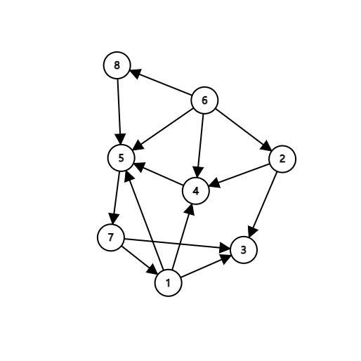
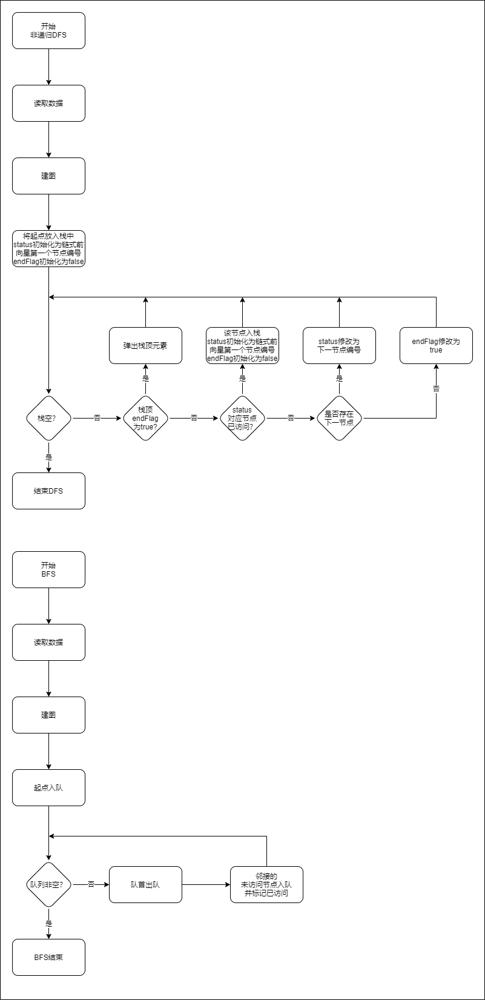
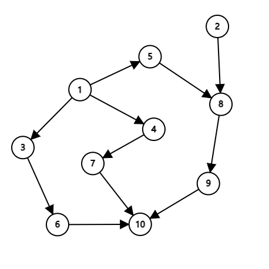
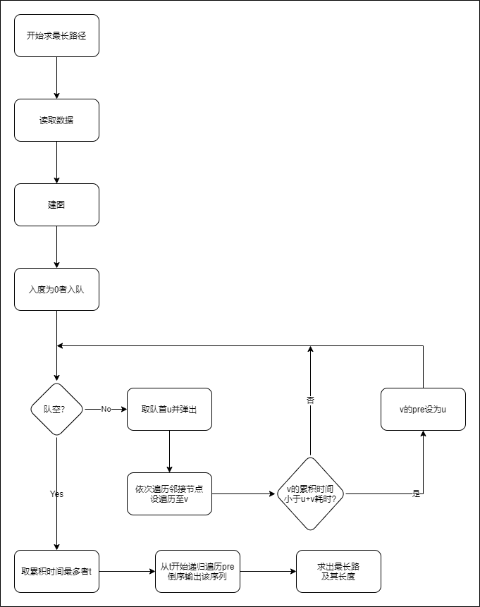

# 《数据结构与算法2021秋》课程报告（实验三）

| 学号       | 姓名   | 得分 |
|------------|------|------|
| 120L021403 | 冯新航 |      |

## 图的遍历

给出一个图，指定开始节点，求其任意DFS序（深度优先搜索序）、BFS序（广度优先搜索序）。

+ 输入格式

第一行两个整数 `n`，`m`，`s`，表示点数、边数和开始节点。

接下来 `m` 行，每行两个整数 `u`，`v`，表示从 `u` 至 `v` 有一条边。

输入保证开始节点能够到达所有节点。

+ 输出格式

第一行 `n` 个整数，表示图的任意DFS序。

第二行 `m` 个整数，表示图的任意BFS序。

+ 样例输入

  ```bash
  8 14 6
  6 2
  6 4
  6 5
  1 4
  1 5
  2 3
  2 4
  4 5
  7 1
  5 7
  7 3
  8 5
  6 8
  1 3
  ```

+ 样例输出

  ```bash
  6 8 5 7 1 3 4 2
  6 8 5 4 2 7 3 1
  ```

+ 样例解释

  如图：

  

  显然可得从 `6` 开始的 DFS 序和 BFS 序。

+ 解决方案
  
  + 流程图

  

  + `Graph`类接口说明
    + `void resetVis()`: 将 `vis` 数组重置为 `false` .
    + `Graph(const Graph &g)`: 隐藏复制构造函数
    + `Graph &operator=(const Graph &g)`: 隐藏等于号运算符的重载
    + `void getDFSRecursion(int u, std::vector<int> &ans)`: 以递归的方式获取 DFS 序的核心方法
    + `explicit Graph(int n = maxNode, int m = maxEdge)`: 将图显式初始化为 `m` 个点 `n` 条边的有向图
    + `void addEdge(int u, int v, int w = 1)`: 添加一条由 `u` 指向 `v` 权值为 `w` 的边
    + `void setNodeWeight(int u, int w)`: 将编号为 `u` 的节点权值设为 `w`
    + `int getNodeWeight(int u)`: 获取编号为 `u` 的节点的权值
    + `std::vector<int>getDFSRecursion(int s)`: 以递归的方式获取以 `s` 为起点的 DFS 序
    + `std::vector<int>getDFSNonRecursion(int s)`: 以非递归的方式获取以 `s` 为起点的 DFS 序
    + `std::vector<int>getBFS(int s)`: 获取以 `s` 为起点的 BFS 序

## 工程安排

一项工程由多道工序组成，按照施工过程的要求，这些工序之间，客观上有一个必须遵守的先后关系。对那些紧接在已知工序前的工序叫紧前工序，把已知工序后边紧接的工序叫后项工序，只有已知工序的所有紧前工序都完成，已知工序才能开始施工。例如某项工程的工序表如下：

| 代号 | 紧前工序 | 完成时间 | 代号 | 紧前工序 | 完成时间 |
|:----:|:--------:|:--------:|:----:|:--------:|:--------:|
|  1   |          |    6     |  6   |    3     |    2     |
|  2   |          |    2     |  7   |    4     |    3     |
|  3   |    1     |    3     |  8   |   2, 5   |    4     |
|  4   |    1     |    5     |  9   |    8     |    2     |
|  5   |    1     |    3     |  10  | 6, 7, 9  |    2     |

给出若干工序及其先后关系、完成所需时间，求完成所有工序所需最短时间。

+ 输入格式

  第一行两个整数 `n`，`m`，表示工艺数，关系数。

  第二行 `n` 个整数，第 `i` 个整数表示第 `i` 号工序所需时间。

  接下来 `m` 行，每行两个整数 `u`，`v`，表示 `u` 是 `v` 的紧前工序。

+ 输出格式

  第一行若干个整数，表示最长关键路径。

  第二行一个整数，表示完成所有工序所需的最少时间。

+ 样例输入

  ```bash
  10 11
  6 2 3 5 3 2 3 4 2 2
  1 3
  1 4 
  1 5
  2 8
  3 6
  4 7
  5 8
  8 9
  6 10
  7 10
  9 10
  ```

+ 样例输出

  ```bash
  1 5 8 9 10
  17
  ```

+ 样例解释

  如图：

  

  工艺线路 `1 -> 5 -> 8 -> 9 -> 10` 所耗费的时间最长，为 `6 + 3 + 4 + 2 + 2 = 17` 。

+ 解决方案
  
  + 流程图

  

  + `Graph`类接口说明
    + `void resetVis()`: 将 `vis` 数组重置为 `false` .
    + `Graph(const Graph &g)`: 隐藏复制构造函数
    + `Graph &operator=(const Graph &g)`: 隐藏等于号运算符的重载
    + `explicit Graph(int n = maxNode, int m = maxEdge)`: 将图显式初始化为 `m` 个点 `n` 条边的有向图
    + `void addEdge(int u, int v, int w = 1)`: 添加一条由 `u` 指向 `v` 权值为 `w` 的边
    + `void setNodeWeight(int u, int w)`: 将编号为 `u` 的节点权值设为 `w`
    + `int getNodeWeight(int u)`: 获取编号为 `u` 的节点的权值
    + `void setNodeWeight(int u, int w)`：设置编号为 `u` 的节点权值为 `w`
    + `int getNodeWeight(int u)`：获取编号为 `u` 的节点权值
    + `std::pair<std::vector<int>, long long>getLongestPath()`：获取拓扑序列的最长路径，以向量形式返回最长路径，并返回最长路径值。

